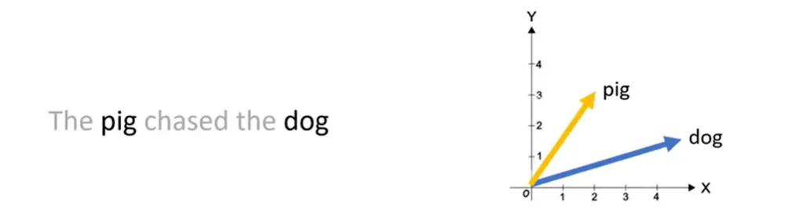
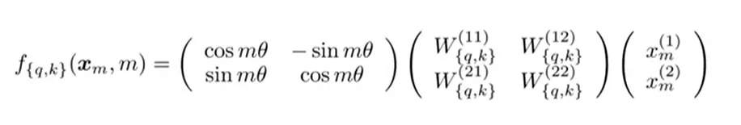

# Rotary Position Embedding
RoPE is a way to tell a transformer model where each token is in a sequence, by rotating its vector representation.

**From:** [https://medium.com/ai-insights-cobet/rotary-positional-embeddings-a-detailed-look-and-comprehensive-understanding-4ff66a874d83]

**Problem that the positional embedding solve:** the model treated the "the dog chases the pig" and "the pig chases the dog" indistinguishably, and considered as the unordered set of tokens. 

**Limitation of the Absolute Positional Embedding**
- **Limited Sequence Length:** the model can learn the positional vectors up to a certain point, it cannot inherently represent positions beyond that limit. 
- **Independence of Positional Embeddings:** Each positional embedding is independent of others. 
    Meaning that in the model's pov, the difference between the p 1 and p2 is the same as between p1 and p500. but, intuitively, p1 and p2 should be more closely related than p500, which is significantly farther away. 

Relative positional embeddings focuses on the distance between pairs of tokens. It does not add a positional vector to the word vector directly. But, it instead alters the attention mechanism to incorporate relative positional information. 

The challenge Relative Positional Embeddings pose:
- **Performance Issues:** slower compared to the other types, particularly for longer sequence because the this would add additional computational step in the self-attention layer, where the positional matrix is added to the query-key matrix.
- **Complexity in Key-Value Cache Usage:** as each additional token alter the embedding for every other tokens, this complicates the effective use of KV cache. 

so for the traditional method, either the relative or absolute, come with limitations. 
- **Relative:** focus on the distance between the tokens, assisting the model to better understand the relationship of the token while introducing the complexities to the architecture. 
- **Absolute:** assign a uniqe vector to each position, but it does not scale well and rather fail to capture the relative position effectively. 

But the RoPE combine the strength of both. 
- It encode the positional information in a way that allow the model to understand both the absolute position of tokens and their relative distances. Achieving through a rotational mechanism, where each position in the sequence is represented by a rotation in the embedding space, enabling the model to better grasp the nuances of the language syntax and semantics. 

- It apples a rotation to the word vector. For a two-dimensional word vector for "dog". to encode its position in a sentence, RoPE rotates this vector, and the angle of the rotation is proportional to the words's position in the sentence. Example: the vector is rotated by $\theta$ for the first position, and $2\theta$ for the second position.
 
this offer: 
- Stability of Vectors: adding the tokens at the end of a sentence does not affect the vector for words at the beginning, facilitating the efficient caching
- Preservation of Relative Positions: if two words, say "pig" and "dog", maintain the same relative distance in different contexts, their vectors are rotated by the same amount. this ensure that the angle, and consequently the dot product between these vectors, remains constant.

Where M is the absolute position in the sentence. 

**Notice:** for higher dimensions, the vector is split into 2D chunks, and each pair is rotated independently. 

